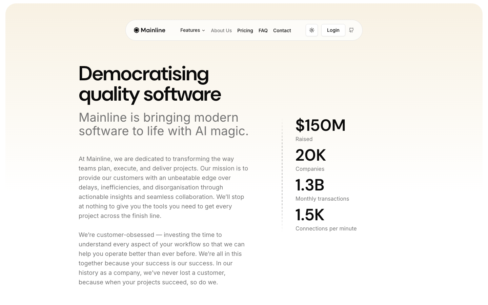

# About Hero + Stats



## Описание
Hero-секция About страницы: большой заголовок, subtitle, длинный текст описания слева и блок статистики справа. Статистика — 4 крупных числа с лейблами.

## Layout
- Container: flex lg:flex-row gap-8 md:gap-14 lg:gap-20
- Wrapper: `from-primary/50 via-background to-background/80 rounded-t-4xl rounded-b-2xl`

## Элементы

### H1 — "Democratising quality software"
- Font: DM Sans 60px (text-6xl) / 600 / line-height 60px
- Letter-spacing: -1.5px
- Classes: `text-3xl tracking-tight sm:text-4xl md:text-5xl lg:text-6xl`

### Subtitle
- "Mainline is bringing modern software to life with AI magic."
- Font: DM Sans 36px / 400 / line-height 40px
- Color: oklch(0.556 0 0) — muted-foreground

### Body Text (2 paragraphs)
- Font: Inter 16px / 400
- Color: oklch(0.556 0 0) — muted-foreground

### Stats Block
4 stat items vertically stacked:
| Value | Label |
|-------|-------|
| $150M | Raised |
| 20K | Companies |
| 1.3B | Monthly transactions |
| 1.5K | Connections per minute |

- Value font: DM Sans 48px / 600
- Letter-spacing: 1.2px (positive!)
- Label: Inter 14px, muted-foreground

## Код компонента
```tsx
const stats = [
  { value: "$150M", label: "Raised" },
  { value: "20K", label: "Companies" },
  { value: "1.3B", label: "Monthly transactions" },
  { value: "1.5K", label: "Connections per minute" },
];

export function AboutHero() {
  return (
    <section>
      <div className="container flex flex-col gap-8 md:gap-14 lg:flex-row lg:gap-20">
        <div className="flex-1">
          <h1 className="text-3xl tracking-tight sm:text-4xl md:text-5xl lg:text-6xl">
            Democratising quality software
          </h1>
          <p className="text-muted-foreground mt-5 text-2xl md:text-4xl">
            Mainline is bringing modern software to life with AI magic.
          </p>
          <div className="text-muted-foreground mt-8 space-y-4 text-base">
            <p>At Mainline, we are dedicated to transforming the way teams plan, execute, and deliver projects...</p>
            <p>We're customer-obsessed — investing the time to understand every aspect of your workflow...</p>
          </div>
        </div>
        <div className="space-y-6">
          {stats.map((s) => (
            <div key={s.label}>
              <div className="text-4xl font-semibold tracking-wide lg:text-5xl">{s.value}</div>
              <div className="text-sm text-muted-foreground">{s.label}</div>
            </div>
          ))}
        </div>
      </div>
    </section>
  );
}
```
