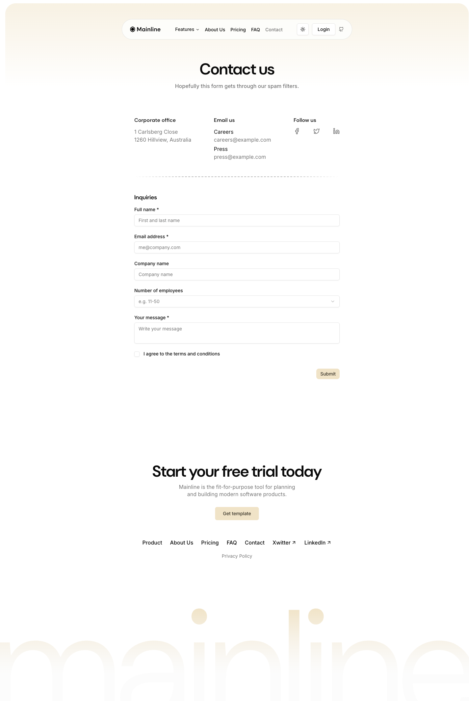

# Contact Page



## Описание
Страница контактов: заголовок + подзаголовок, информационный блок (офис, email, соцсети), dashed divider, форма с полями.

## Layout
- Main wrapper: gradient background как на других страницах
- Content centered, max-width restricted

## Элементы

### H1 — "Contact us"
- Font: DM Sans 48px / 600
- Letter-spacing: -1.2px
- Text-align: center

### Subtitle
- "Hopefully this form gets through our spam filters."
- Font: Inter 16px / 400
- Color: muted-foreground
- Text-align: center

### Info Grid (3 columns)
#### Corporate office
- "1 Carlsberg Close"
- "1260 Hillview, Australia"

#### Email us
- Careers: careers@example.com (mailto link)
- Press: press@example.com (mailto link)

#### Follow us
- 3 social icons (Facebook, Twitter/X, LinkedIn)
- Size: ~24px, muted color, hover:foreground

### Dashed Divider
- Same pattern as main page sections

### Form — "Inquiries"

#### H2 — "Inquiries"
- Font: DM Sans, semibold

#### Form Fields
All inputs use shadcn/ui Input component:
- Height: 36px (h-9)
- Padding: 4px 12px
- Border: 1px solid oklch(0.922 0 0)
- Border-radius: 6px
- Background: transparent
- Font: Inter 14px
- Box-shadow: shadow-2xs
- Placeholder: text-muted-foreground

Fields:
1. **Full name** * — text input, placeholder "First and last name"
2. **Email address** * — text input, placeholder "me@company.com"
3. **Company name** — text input
4. **Number of employees** — select/combobox, placeholder "e.g. 11-50"
5. **Your message** * — textarea, placeholder "Write your message", min-height 64px
6. **Checkbox** — "I agree to the terms and conditions"

#### Labels
- Font: Inter 14px / 500
- Color: oklch(0.145 0 0)

#### Submit Button
- Background: oklch(0.92 0.04 86.47) — primary
- Color: oklch(0.31 0.02 86.64)
- Border-radius: 6px
- Font: Inter 14px / 500
- Aligned right

## Код компонента
```tsx
import { Button } from "@/components/ui/button";
import { Input } from "@/components/ui/input";
import { Textarea } from "@/components/ui/textarea";
import { Label } from "@/components/ui/label";
import { Checkbox } from "@/components/ui/checkbox";
import { Select, SelectContent, SelectItem, SelectTrigger, SelectValue } from "@/components/ui/select";

export function ContactPage() {
  return (
    <div className="container max-w-3xl py-28 lg:py-32 lg:pt-44">
      <div className="text-center">
        <h1 className="text-3xl tracking-tight md:text-4xl lg:text-5xl">Contact us</h1>
        <p className="text-muted-foreground mt-4">Hopefully this form gets through our spam filters.</p>
      </div>

      {/* Info grid */}
      <div className="mt-12 grid gap-8 md:grid-cols-3">
        <div>
          <h2 className="font-semibold">Corporate office</h2>
          <p className="text-sm text-muted-foreground mt-2">1 Carlsberg Close<br />1260 Hillview, Australia</p>
        </div>
        <div>
          <h2 className="font-semibold">Email us</h2>
          <div className="mt-2 space-y-2 text-sm">
            <div><p className="text-muted-foreground">Careers</p><a href="mailto:careers@example.com">careers@example.com</a></div>
            <div><p className="text-muted-foreground">Press</p><a href="mailto:press@example.com">press@example.com</a></div>
          </div>
        </div>
        <div>
          <h2 className="font-semibold">Follow us</h2>
          <div className="mt-2 flex gap-4">{/* Social icons */}</div>
        </div>
      </div>

      {/* Divider */}
      <div className="my-12 h-px w-full text-muted-foreground bg-[repeating-linear-gradient(90deg,transparent,transparent_4px,currentColor_4px,currentColor_10px)] [mask-image:linear-gradient(90deg,transparent,black_25%,black_75%,transparent)]" />

      {/* Form */}
      <div>
        <h2 className="text-lg font-semibold">Inquiries</h2>
        <form className="mt-6 space-y-6">
          <div>
            <Label>Full name *</Label>
            <Input placeholder="First and last name" />
          </div>
          <div>
            <Label>Email address *</Label>
            <Input type="email" placeholder="me@company.com" />
          </div>
          <div>
            <Label>Company name</Label>
            <Input placeholder="Company name" />
          </div>
          <div>
            <Label>Number of employees</Label>
            <Select>
              <SelectTrigger><SelectValue placeholder="e.g. 11-50" /></SelectTrigger>
              <SelectContent>
                <SelectItem value="1-10">1-10</SelectItem>
                <SelectItem value="11-50">11-50</SelectItem>
                <SelectItem value="51-200">51-200</SelectItem>
                <SelectItem value="200+">200+</SelectItem>
              </SelectContent>
            </Select>
          </div>
          <div>
            <Label>Your message *</Label>
            <Textarea placeholder="Write your message" className="min-h-16" />
          </div>
          <div className="flex items-center gap-2">
            <Checkbox id="terms" />
            <label htmlFor="terms" className="text-sm">I agree to the terms and conditions</label>
          </div>
          <div className="flex justify-end">
            <Button type="submit">Submit</Button>
          </div>
        </form>
      </div>
    </div>
  );
}
```
