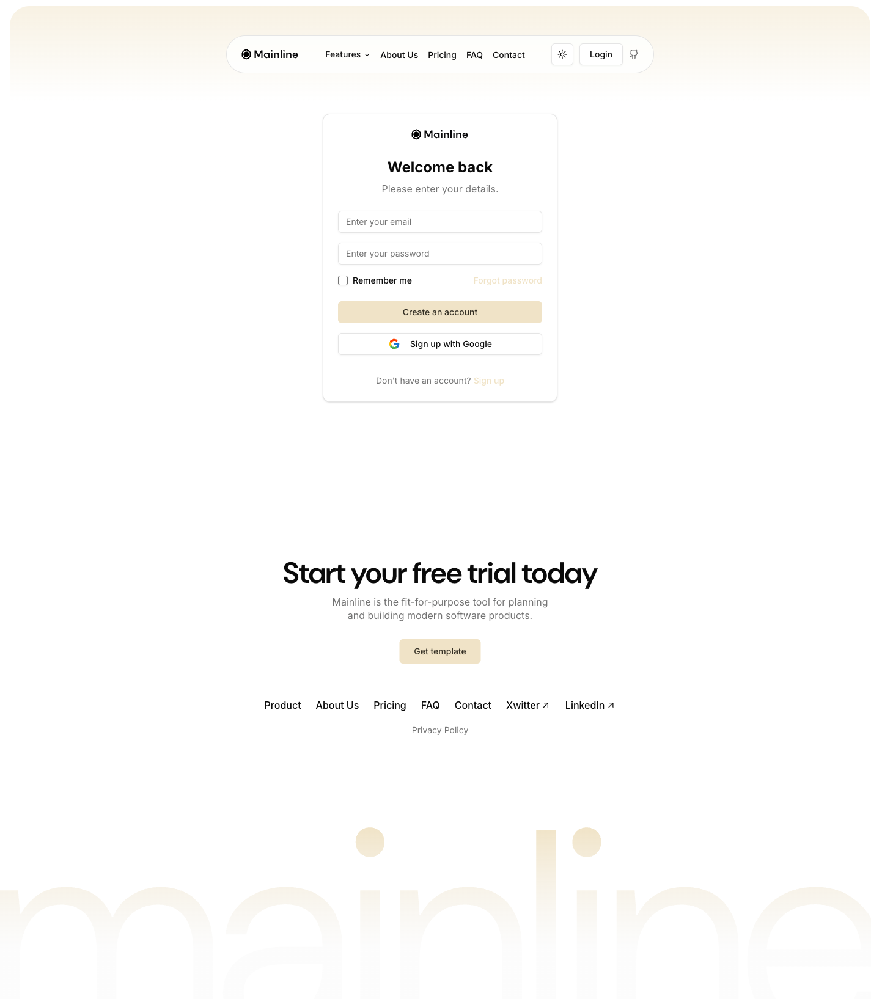

# Login Page



## Описание
Минималистичная страница логина: логотип по центру, "Welcome back", два поля ввода, remember me + forgot password, CTA-кнопка и Google sign-in. Всё центрировано на странице.

## Layout
- Content: centered card, max-width ~400px
- Background: gradient wrapper как на других страницах

## Элементы

### Logo
- Centered at top of card
- Same logo as in header

### "Welcome back" Title
- Font: DM Sans, semibold, ~24px
- Text-align: center

### "Please enter your details."
- Font: Inter 14px
- Color: muted-foreground
- Text-align: center

### Email Input
- Placeholder: "Enter your email"
- shadcn/ui Input: h-9, border, rounded-md, shadow-2xs

### Password Input
- Placeholder: "Enter your password"
- Type: password

### Remember me + Forgot password Row
- Flex justify-between
- Checkbox "Remember me" — shadcn/ui Checkbox
- "Forgot password" — link, primary color

### "Create an account" Button
- Background: oklch(0.92 0.04 86.47) — primary
- Color: oklch(0.31 0.02 86.64)
- Border-radius: 6px
- Padding: 8px 16px
- Font: Inter 14px / 500
- Height: 36px
- Full width

### "Sign up with Google" Button
- Background: oklch(1 0 0) — white
- Color: oklch(0.145 0 0)
- Border: 1px solid oklch(0.922 0 0)
- Border-radius: 6px
- Google icon (G logo)
- Full width

### "Don't have an account? Sign up"
- Font: Inter 14px
- "Sign up" — link, primary color, href="/signup"

## Код компонента
```tsx
import Link from "next/link";
import { Button } from "@/components/ui/button";
import { Input } from "@/components/ui/input";
import { Checkbox } from "@/components/ui/checkbox";

export function LoginPage() {
  return (
    <div className="flex min-h-[60vh] items-center justify-center py-28 lg:pt-44">
      <div className="w-full max-w-sm space-y-6 rounded-xl border bg-background p-8 shadow-sm">
        {/* Logo */}
        <div className="flex justify-center">
          
        </div>

        {/* Title */}
        <div className="text-center">
          <p className="text-lg font-semibold">Welcome back</p>
          <p className="text-sm text-muted-foreground">Please enter your details.</p>
        </div>

        {/* Form */}
        <div className="space-y-4">
          <Input placeholder="Enter your email" />
          <Input type="password" placeholder="Enter your password" />

          <div className="flex items-center justify-between">
            <div className="flex items-center gap-2">
              <Checkbox id="remember" />
              <label htmlFor="remember" className="text-sm">Remember me</label>
            </div>
            <Link href="#" className="text-sm text-primary hover:underline">Forgot password</Link>
          </div>

          <Button className="w-full">Create an account</Button>
          <Button variant="outline" className="w-full gap-2">
            
            Sign up with Google
          </Button>
        </div>

        {/* Sign up link */}
        <p className="text-center text-sm text-muted-foreground">
          Don't have an account?{" "}
          <Link href="/signup" className="text-primary hover:underline">Sign up</Link>
        </p>
      </div>
    </div>
  );
}
```
