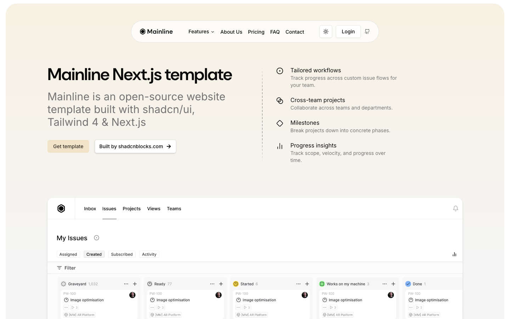
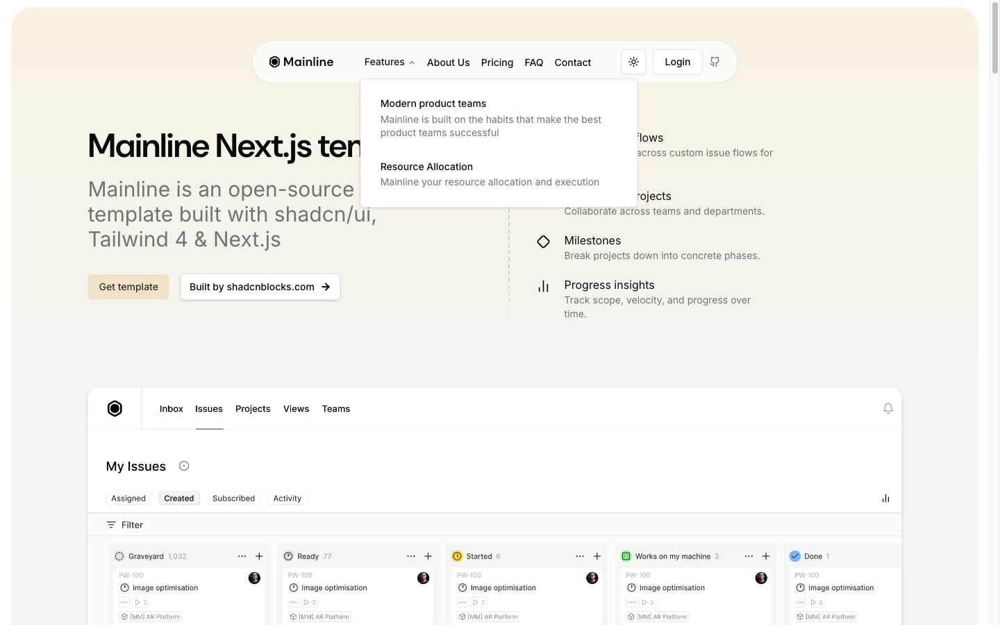

# Header -- Floating Pill Navbar




## Описание
Floating pill navbar -- центрированный навбар в форме "пилюли" с backdrop-blur. Содержит logo, nav links, Features dropdown, theme toggle, Login, GitHub.

## shadcnblocks
Категория: **Navbar** | Ближайший аналог: navbar-1 | URL: https://www.shadcnblocks.com/blocks/navbar

## Layout -- Outer shell (pill)
```
position: absolute (fixed on scroll)
width: min(90%, 700px)
top: 20px (mobile, top-5) / 48px (desktop, lg:top-12)
left: 50%; transform: translateX(-50%)
z-index: 50
height: 62px
border-radius: 32px (rounded-4xl)
background: oklch(100% 0 0 / 0.7) -- bg-background/70
backdrop-filter: blur(12px) -- backdrop-blur-md
border: 1px solid oklch(92.2% 0 0)
transition: all 0.3s cubic-bezier(0.4, 0, 0.2, 1)
```

## Layout -- Inner container
```
display: flex; align-items: center; justify-content: space-between
padding: 12px 24px (py-3 px-6)
```

## Tailwind classes
```
Outer: bg-background/70 absolute left-1/2 z-50 w-[min(90%,700px)] -translate-x-1/2 rounded-4xl border backdrop-blur-md transition-all duration-300 top-5 lg:top-12
Inner: flex items-center justify-between px-6 py-3
```

## Элементы

### Logo
- **Tag:** `<a href="/"></a>`
- **Size:** 94px x 18px
- **Classes:** `flex shrink-0 items-center gap-2`

### Nav Links (desktop, max-lg:hidden)
- **Font:** Inter 14px / weight 500
- **Color:** oklch(14.5% 0 0) -- foreground
- **Padding:** 0 6px (px-1.5)
- **Transition:** opacity 0.15s cubic-bezier(0.4, 0, 0.2, 1)
- **Items:** Features (dropdown), About Us, Pricing, FAQ, Contact

### Features Dropdown (Radix NavigationMenu)
- **Trigger:** `<button>Features <ChevronDown /></button>`, padding 8px 6px, border-radius 6px
- **Content container:**
  - Width: 400px
  - Background: oklch(100% 0 0) -- bg-popover
  - Border: 1px solid oklch(92.2% 0 0)
  - Border-radius: 6px
  - Box-shadow: shadow-sm (0 1px 3px 0px rgba(0,0,0,0.1), 0 1px 2px -1px rgba(0,0,0,0.1))
  - Animation: data-[state=open]:animate-in data-[state=open]:zoom-in-95
- **Link items:**
  - display: flex, gap: 16px, padding: 12px, border-radius: 6px
  - Title: Inter 16px/500, oklch(14.5% 0 0)
  - Description: Inter 14px/400, oklch(55.6% 0 0)
  - Hover: bg-accent oklch(97% 0 0)
  - Transition: all 0.15s cubic-bezier(0.4, 0, 0.2, 1)

### Theme Toggle
- **Type:** ghost button, 36px square (h-9 w-9)
- **Icon:** Sun / Moon (lucide-react), 20px

### Login Button
- **Tag:** `<a href="/login"><button>Login</button></a>`
- **Style:** ghost/outline -- padding 8px 6px, border-radius 6px, Inter 14px/500
- **Border:** 1px solid oklch(92.2% 0 0) (via NavigationMenu styling)

### GitHub Link
- **Icon:** GitHub SVG, 20px
- **Style:** ghost button

## Responsive
- **Desktop (lg+):** Full nav links visible, dropdown on Features hover
- **Mobile (<lg):** Nav links hidden (max-lg:hidden), hamburger menu appears
- **Top:** top-5 (20px) mobile, lg:top-12 (48px) desktop
