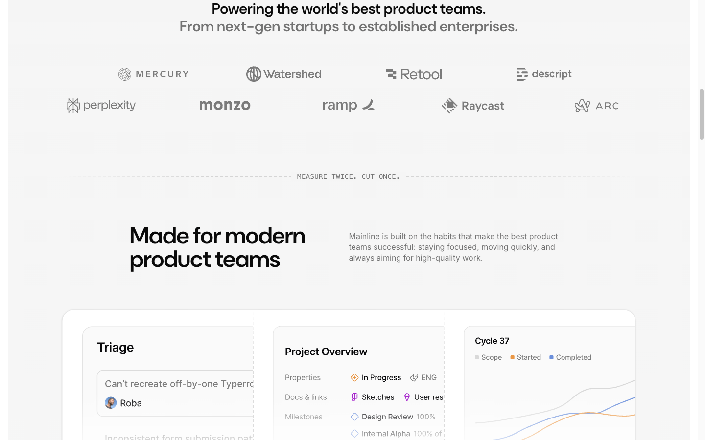

# Logo Cloud / Partners Section



## Описание
Секция с заголовком и двумя рядами логотипов партнёров. Логотипы анимированы горизонтальным скроллом (marquee). Две строки, вторая строка содержит 5 логотипов.

## Layout
- Section classes: `pb-28 lg:pb-32 overflow-hidden`
- Padding: 0 top, 128px bottom
- Container: max-width 1220px, padding 0 24px
- Space-y: 10 (40px) lg:space-y-16 (64px)

## Элементы

### H2 — "Powering the world's best product teams."
- Font: DM Sans 30px (text-3xl) / 600 / line-height 36px
- Color: oklch(0.145 0 0)
- Text-align: center
- Second line: "From next-gen startups to established enterprises." — separate text node, same styling
- Classes: `mb-4 text-xl text-balance md:text-2xl lg:text-3xl`

### Logo Rows
Two rows with infinite scroll animation:
- Row 1: Mercury, Watershed, Retool, Descript (duplicated 3x for marquee)
- Row 2: Perplexity, Monzo, Ramp, Raycast, Arc (duplicated 3x for marquee)

Each logo:
- Tag: `<a href="{company url}">`
- Image: SVG from `/logos/{name}.svg`
- Grayscale appearance (muted-foreground color)
- Height: varies (~20-30px)
- Inline animation: `@keyframes scroll { 0% translateX(0) -> 100% translateX(-100%) }`

### Scroll Animation
```css
@keyframes scroll {
  0% { transform: translateX(0%); }
  100% { transform: translateX(-100%); }
}
```
Applied with CSS to the row containers for infinite marquee effect.

## Код компонента
```tsx
import Link from "next/link";

const logosRow1 = [
  { name: "Mercury", href: "https://mercury.com", src: "/logos/mercury.svg" },
  { name: "Watershed", href: "https://watershed.com", src: "/logos/watershed.svg" },
  { name: "Retool", href: "https://retool.com", src: "/logos/retool.svg" },
  { name: "Descript", href: "https://descript.com", src: "/logos/descript.svg" },
];

const logosRow2 = [
  { name: "Perplexity", href: "https://perplexity.com", src: "/logos/perplexity.svg" },
  { name: "Monzo", href: "https://monzo.com", src: "/logos/monzo.svg" },
  { name: "Ramp", href: "https://ramp.com", src: "/logos/ramp.svg" },
  { name: "Raycast", href: "https://raycast.com", src: "/logos/raycast.svg" },
  { name: "Arc", href: "https://arc.com", src: "/logos/arc.svg" },
];

function LogoRow({ logos }: { logos: typeof logosRow1 }) {
  const tripled = [...logos, ...logos, ...logos];
  return (
    <div className="flex animate-[scroll_30s_linear_infinite] items-center gap-16">
      {tripled.map((logo, i) => (
        <Link key={`${logo.name}-${i}`} href={logo.href} className="shrink-0">
          
        </Link>
      ))}
    </div>
  );
}

export function LogoCloud() {
  return (
    <section className="pb-28 lg:pb-32 overflow-hidden">
      <div className="container space-y-10 lg:space-y-16">
        <h2 className="mb-4 text-center text-xl text-balance md:text-2xl lg:text-3xl">
          <span className="block">Powering the world's best product teams.</span>
          <span className="text-muted-foreground">From next-gen startups to established enterprises.</span>
        </h2>
        <div className="space-y-8 overflow-hidden">
          <LogoRow logos={logosRow1} />
          <LogoRow logos={logosRow2} />
        </div>
      </div>
    </section>
  );
}
```
