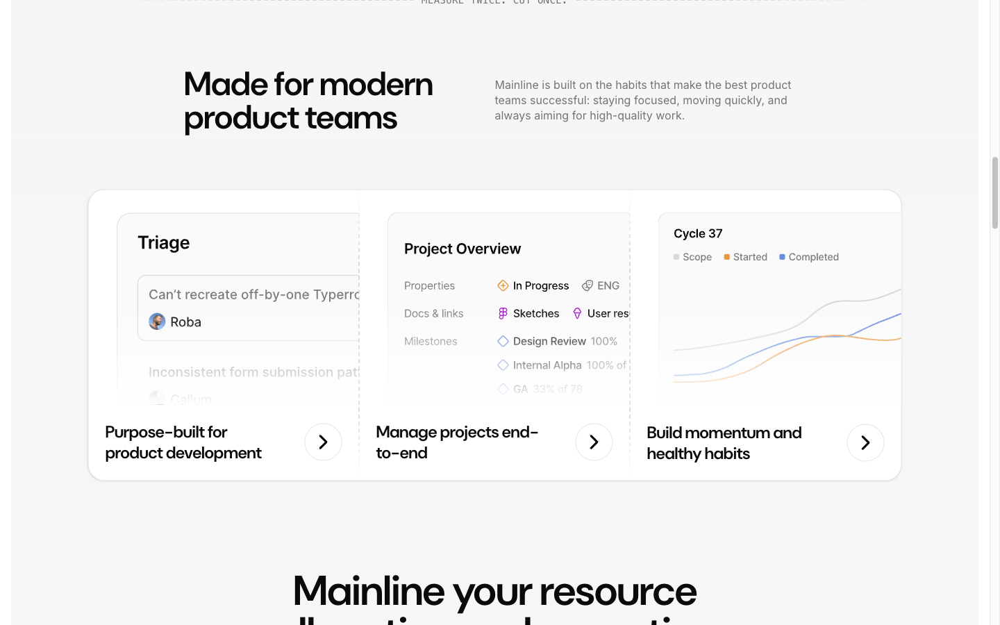

# Features -- "Made for Modern Product Teams"



## Описание
Badge + заголовок + описание (2-col grid), затем большая карточка с 3 feature items (image + title + arrow). Карточки расположены горизонтально.

## shadcnblocks
Категория: **Feature** | Ближайший аналог: feature-1 | URL: https://www.shadcnblocks.com/blocks/feature

## Section
```
id: feature-modern-teams
Classes: pb-28 lg:pb-32
Padding: 0 top, 128px bottom
```

## Container: `container` (1220px, px 24px)

## Badge
- **Text:** "MEASURE TWICE. CUT ONCE."
- **Classes:** `relative flex items-center justify-center`
- **Font:** Inter 16px/400, oklch(14.5% 0 0)

## H2
- **Classes:** `text-2xl tracking-tight md:text-4xl lg:text-5xl`
- **Font:** DM Sans 48px/600, line-height 48px, letter-spacing -1.2px

## Description
- **Classes:** `text-muted-foreground leading-snug`
- **Font:** Inter 16px/400, line-height 22px, oklch(55.6% 0 0)

## Title+desc grid
- **Classes:** `mx-auto mt-10 grid max-w-4xl items-center gap-3 md:gap-0 lg:mt-24 lg:grid-cols-2`
- max-width: 896px, margin-top: 96px (lg)

## Big Feature Card
- **Classes:** `bg-card text-card-foreground border shadow-sm mt-8 rounded-3xl md:mt-12 lg:mt-20`
- border-radius: 24px, border: 1px solid oklch(92.2% 0 0), bg: white, shadow-sm
- margin-top: 80px (lg:mt-20)
- Inner: `flex p-0 max-md:flex-col`

### Feature columns (x3)
- Image wrapper: `relative aspect-[1.28/1] overflow-hidden`, ~365px wide
- Link: `group flex items-center justify-between gap-4 pe-6 pt-6`
- H3: DM Sans 24px/600, line-height 30px, letter-spacing -0.6px
- Arrow icon: transitions on group-hover
