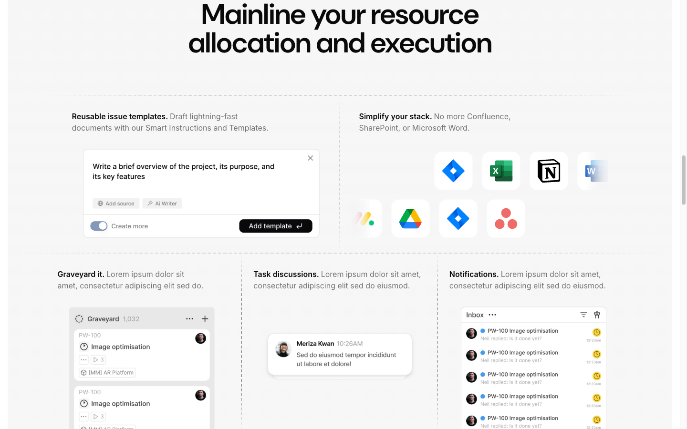

# Bento Grid — "Resource Allocation and Execution"



## Описание
Bento grid секция с большим заголовком по центру, затем два ряда карточек: верхний ряд — 2 больших карточки (flex 50/50), нижний ряд — 3 карточки (grid 3 columns). Карточки с заголовком, описанием и изображением. Разделители — dashed lines.

## Layout
- Section id: `resource-allocation`
- Section classes: `overflow-hidden pb-28 lg:pb-32`
- Padding: 0 top, 128px bottom

## Элементы

### H2 — "Mainline your resource allocation and execution"
- Font: DM Sans 60px (text-6xl) / 600 / line-height 60px
- Letter-spacing: -1.5px
- Text-align: center
- Text-balance
- Container max-width: 1220px (container class)
- Classes: `container text-center text-3xl tracking-tight text-balance sm:text-4xl md:text-5xl lg:text-6xl`

### Dashed Line Dividers
- `h-px w-full text-muted-foreground` with repeating-linear-gradient
- Container: max-w-7xl or container, scale-x-105/110
- Pattern: `bg-[repeating-linear-gradient(90deg,transparent,transparent_4px,currentColor_4px,currentColor_10px)]`
- Mask: fading edges

### Top Row (2 cards)
- Container: `relative container flex max-md:flex-col`
- Each card: `flex-1` — 50% width on desktop
- Vertical dashed divider between cards

#### Card 1: "Reusable issue templates."
- Title: DM Sans, bold
- Description: "Draft lightning-fast documents with our Smart Instructions and Templates."
- Image: `/resource-allocation/templates.webp`
- Padding: 32px 24px (md:px-6 md:py-8)

#### Card 2: "Simplify your stack."
- Title: DM Sans, bold
- Description: "No more Confluence, SharePoint, or Microsoft Word."
- Image: Grid of app logos (Jira, Excel, Notion, Word, Monday, Google Drive, etc.)
- Logo images from `/logos/` directory

### Bottom Row (3 cards)
- Container: `relative container grid max-w-7xl md:grid-cols-3`
- Grid: 3 equal columns (410px each at 1440px viewport)
- Vertical dashed dividers between cards

#### Card 3: "Graveyard it."
- Image: `/resource-allocation/graveyard.webp`
- Description: Lorem ipsum...
- Padding bottom: 0 (image bleeds to bottom)

#### Card 4: "Task discussions."
- Image: `/resource-allocation/discussions.webp`
- Chat bubble style image
- flex column, justify-normal

#### Card 5: "Notifications."
- Image: `/resource-allocation/notifications.webp`
- Inbox-style notification list
- Padding bottom: 0

### Card Common Styles
- Title (h3): DM Sans font-semibold
- Description: muted-foreground, Inter
- Layout: flex flex-col justify-between
- Padding: py-6 md:py-8 px-0 md:px-6
- Images in separate `.image-container` div

## Код компонента
```tsx
const topCards = [
  { title: "Reusable issue templates.", desc: "Draft lightning-fast documents with our Smart Instructions and Templates.", img: "/resource-allocation/templates.webp" },
  { title: "Simplify your stack.", desc: "No more Confluence, SharePoint, or Microsoft Word.", hasLogos: true },
];

const bottomCards = [
  { title: "Graveyard it.", desc: "Lorem ipsum dolor sit amet, consectetur adipiscing elit sed do.", img: "/resource-allocation/graveyard.webp" },
  { title: "Task discussions.", desc: "Lorem ipsum dolor sit amet, consectetur adipiscing elit sed do eiusmod.", img: "/resource-allocation/discussions.webp" },
  { title: "Notifications.", desc: "Lorem ipsum dolor sit amet, consectetur adipiscing elit sed do eiusmod.", img: "/resource-allocation/notifications.webp" },
];

export function BentoGrid() {
  return (
    <section id="resource-allocation" className="overflow-hidden pb-28 lg:pb-32">
      <div>
        <h2 className="container text-center text-3xl tracking-tight text-balance sm:text-4xl md:text-5xl lg:text-6xl">
          Mainline your resource allocation and execution
        </h2>

        <div className="mt-8 md:mt-12 lg:mt-20">
          {/* Dashed line */}
          <div className="text-muted-foreground relative h-px w-full container scale-x-105 bg-[repeating-linear-gradient(90deg,transparent,transparent_4px,currentColor_4px,currentColor_10px)] [mask-image:linear-gradient(90deg,transparent,black_25%,black_75%,transparent)]" />

          {/* Top row: 2 cards */}
          <div className="relative container flex max-md:flex-col">
            {topCards.map((card, i) => (
              <div key={card.title} className="relative flex flex-1 flex-col justify-between px-0 py-6 md:px-6 md:py-8">
                <div>
                  <h3 className="font-semibold">{card.title}</h3>
                  <span className="text-muted-foreground">{card.desc}</span>
                </div>
                {card.img && }
              </div>
            ))}
          </div>

          {/* Dashed line */}
          <div className="text-muted-foreground relative h-px w-full container max-w-7xl scale-x-110 bg-[repeating-linear-gradient(90deg,transparent,transparent_4px,currentColor_4px,currentColor_10px)] [mask-image:linear-gradient(90deg,transparent,black_25%,black_75%,transparent)]" />

          {/* Bottom row: 3 cards */}
          <div className="relative container grid max-w-7xl md:grid-cols-3">
            {bottomCards.map((card) => (
              <div key={card.title} className="relative flex flex-col justify-between px-0 py-6 md:px-6 md:py-8 md:pb-0">
                <div>
                  <h3 className="font-semibold">{card.title}</h3>
                  <span className="text-muted-foreground">{card.desc}</span>
                </div>
                
              </div>
            ))}
          </div>
        </div>

        {/* Bottom dashed line */}
        <div className="text-muted-foreground relative h-px w-full container max-w-7xl scale-x-110 bg-[repeating-linear-gradient(90deg,transparent,transparent_4px,currentColor_4px,currentColor_10px)] [mask-image:linear-gradient(90deg,transparent,black_25%,black_75%,transparent)]" />
      </div>
    </section>
  );
}
```
