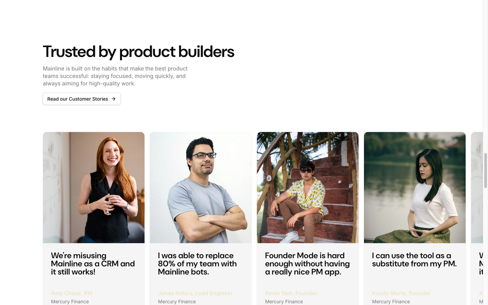

# Testimonials Section — "Trusted by Product Builders"



## Описание
Секция с заголовком, описанием, CTA-кнопкой слева и горизонтальной каруселью отзывов. Карточки с фото, цитатой, именем и компанией. Навигация карусели — две кнопки prev/next внизу.

## Layout
- Section classes: `overflow-hidden py-28 lg:py-32`
- Padding: 128px vertical

## Элементы

### Left Column (text)
- Container: с padding

### H2 — "Trusted by product builders"
- Font: DM Sans 48px / 600 / line-height 48px
- Letter-spacing: -1.2px
- Color: oklch(0.145 0 0)

### Description
- Font: Inter 16px / 400
- Color: oklch(0.556 0 0) — muted-foreground

### "Read our Customer Stories" Button
- Variant: outline
- Background: oklch(1 0 0)
- Color: oklch(0.145 0 0)
- Border: 1px solid oklch(0.922 0 0)
- Border-radius: 6px
- Padding: 8px 12px
- Font: Inter 14px / 500
- Has arrow icon

### Carousel (Embla/custom)
- Horizontal scroll, overflow hidden
- Cards in flex row with gap
- Navigation: prev/next buttons at bottom left

### Testimonial Card
- Width: ~300px
- Layout: flex column
- Padding: 24px (p-6)
- Gap: 40px between image and text

#### Avatar Image
- Full-width photo
- Aspect: portrait
- Border-radius: implicit from container
- Object-fit: cover

#### Quote (blockquote)
- Font: DM Sans (display family), larger text
- Color: oklch(0.145 0 0)

#### Name
- Color: oklch(0.92 0.04 86.47) — var(--primary) — warm beige/yellow
- Font: Inter, font-medium

#### Company
- Color: oklch(0.556 0 0) — muted-foreground
- Font: Inter 14px

### Carousel Navigation
- Two buttons: Previous / Next
- Style: outline, icon-only
- Size: small (fit-content)
- Positioned bottom-left under carousel

## Данные отзывов
```
1. Amy Chase, PM — Mercury Finance
   "We're misusing Mainline as a CRM and it still works!"

2. Jonas Kotara, Lead Engineer — Mercury Finance
   "I was able to replace 80% of my team with Mainline bots."

3. Kevin Yam, Founder — Mercury Finance
   "Founder Mode is hard enough without having a really nice PM app."

4. Kundo Marta, Founder — Mercury Finance
   "I can use the tool as a substitute from my PM."
```

## Используется на страницах
- Главная (/)
- FAQ (/faq)

## Код компонента
```tsx
import { Button } from "@/components/ui/button";
import { ArrowRight, ChevronLeft, ChevronRight } from "lucide-react";

const testimonials = [
  { name: "Amy Chase, PM", company: "Mercury Finance", quote: "We're misusing Mainline as a CRM and it still works!", avatar: "/testimonials/1.webp" },
  { name: "Jonas Kotara, Lead Engineer", company: "Mercury Finance", quote: "I was able to replace 80% of my team with Mainline bots.", avatar: "/testimonials/2.webp" },
  { name: "Kevin Yam, Founder", company: "Mercury Finance", quote: "Founder Mode is hard enough without having a really nice PM app.", avatar: "/testimonials/3.webp" },
  { name: "Kundo Marta, Founder", company: "Mercury Finance", quote: "I can use the tool as a substitute from my PM.", avatar: "/testimonials/4.webp" },
];

export function TestimonialsSection() {
  return (
    <section className="overflow-hidden py-28 lg:py-32">
      <div className="container">
        <h2 className="text-3xl tracking-tight md:text-4xl lg:text-5xl">
          Trusted by product builders
        </h2>
        <p className="text-muted-foreground mt-4 max-w-md leading-snug">
          Mainline is built on the habits that make the best product teams successful:
          staying focused, moving quickly, and always aiming for high-quality work.
        </p>
        <Button variant="outline" className="mt-6 gap-2">
          Read our Customer Stories <ArrowRight className="size-4" />
        </Button>
      </div>

      {/* Carousel */}
      <div className="mt-10 overflow-hidden">
        <div className="flex gap-6 px-6">
          {testimonials.map((t) => (
            <div key={t.name} className="flex flex-1 shrink-0 basis-[300px] flex-col gap-10 p-6">
              
              <div>
                <blockquote className="text-xl font-semibold tracking-tight">{t.quote}</blockquote>
                <div className="mt-4">
                  <div className="text-primary font-medium">{t.name}</div>
                  <div className="text-muted-foreground text-sm">{t.company}</div>
                </div>
              </div>
            </div>
          ))}
        </div>
      </div>

      {/* Navigation */}
      <div className="container mt-6 flex gap-2">
        <Button variant="outline" size="icon"><ChevronLeft className="size-4" /></Button>
        <Button variant="outline" size="icon"><ChevronRight className="size-4" /></Button>
      </div>
    </section>
  );
}
```
