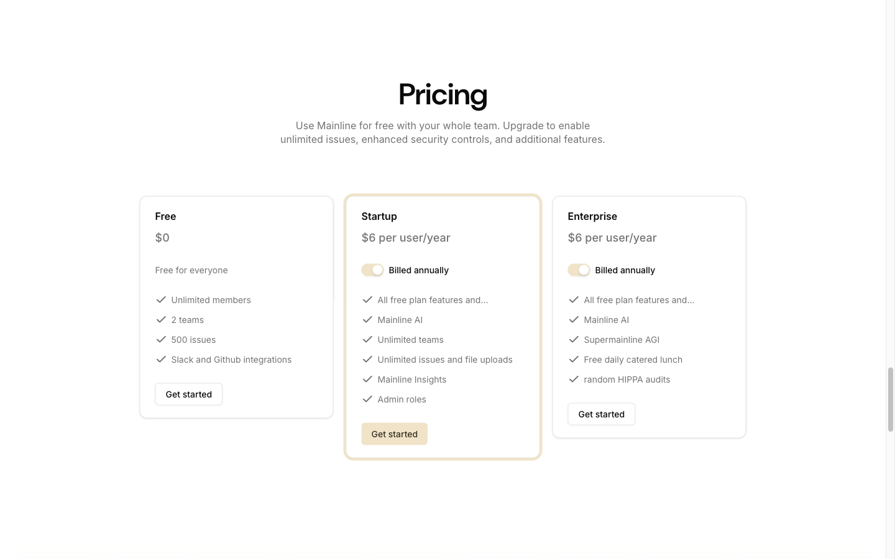

# Pricing Section



## Описание
Секция с тремя pricing-карточками: Free, Startup (highlighted), Enterprise. Каждая карточка со списком фич, ценой и CTA-кнопкой. Startup карточка подсвечена primary border.

## Layout
- Section classes: `py-28 lg:py-32`
- Padding: 128px vertical
- Внутри обёрточного div `from-background via-background to-primary/50 rounded-t-2xl rounded-b-4xl`
- Container: max-w-5xl (1024px)
- Text-align: center для header

## Элементы

### H2 — "Pricing"
- Font: DM Sans 48px / 600
- Letter-spacing: -1.2px
- Text-align: center

### Description
- Font: Inter 16px / 400
- Color: oklch(0.556 0 0) — muted-foreground
- Max-width: xl (576px), mx-auto, text-balance

### Cards Grid
- Grid: `mt-8 md:mt-12 lg:mt-20 grid md:grid-cols-3 gap-5 items-start text-start`
- 3 columns, gap 20px, items aligned to start

### Pricing Card (common)
- Background: oklch(1 0 0) — white
- Border: 1px solid oklch(0.922 0 0) — var(--border)
- Border-radius: 12px (rounded-lg)
- Box-shadow: shadow-sm
- Inner padding: 20px 24px (py-5 px-6)
- Layout: flex flex-col gap-7

#### Card Title (h3)
- Font: DM Sans / 600
- Size: 18-20px

#### Price
- Large number: DM Sans ~36px / 600
- "per user/year": small muted text

#### Annual Toggle (Startup/Enterprise only)
- Switch component (shadcn)
- Label: "Billed annually"

#### Features List
- Each item: flex gap-2 items-center
- Checkmark icon (primary color)
- Text: Inter 14px

#### CTA Button — "Get started"
- Primary variant for highlighted
- Outline variant for others
- Full-width or auto
- Font: Inter 14px / 500

### Highlighted Card (Startup)
- Border: 2px solid var(--primary) — oklch(0.92 0.04 86.47)
- Or ring effect around card
- Otherwise same structure

## Используется на страницах
- Главная (/)
- Pricing (/pricing)

## Код компонента
```tsx
import { Button } from "@/components/ui/button";
import { Switch } from "@/components/ui/switch";
import { Check } from "lucide-react";

const plans = [
  {
    name: "Free",
    price: "$0",
    description: "Free for everyone",
    features: ["Unlimited members", "2 teams", "500 issues", "Slack and Github integrations"],
    highlighted: false,
  },
  {
    name: "Startup",
    price: "$6",
    priceSuffix: "per user/year",
    hasToggle: true,
    features: ["All free plan features and...", "Mainline AI", "Unlimited teams", "Unlimited issues and file uploads", "Mainline Insights", "Admin roles"],
    highlighted: true,
  },
  {
    name: "Enterprise",
    price: "$6",
    priceSuffix: "per user/year",
    hasToggle: true,
    features: ["All free plan features and...", "Mainline AI", "Supermainline AGI", "Free daily catered lunch", "random HIPPA audits"],
    highlighted: false,
  },
];

export function PricingSection() {
  return (
    <section className="py-28 lg:py-32">
      <div className="container max-w-5xl">
        <div className="text-center">
          <h2 className="text-3xl tracking-tight md:text-4xl lg:text-5xl">Pricing</h2>
          <p className="text-muted-foreground mx-auto mt-4 max-w-xl leading-snug text-balance">
            Use Mainline for free with your whole team. Upgrade to enable unlimited issues,
            enhanced security controls, and additional features.
          </p>
        </div>

        <div className="mt-8 grid items-start gap-5 text-start md:mt-12 md:grid-cols-3 lg:mt-20">
          {plans.map((plan) => (
            <div
              key={plan.name}
              className={`rounded-xl border bg-background p-0 shadow-sm ${
                plan.highlighted ? "ring-2 ring-primary" : ""
              }`}
            >
              <div className="flex flex-col gap-7 px-6 py-5">
                <div>
                  <h3 className="font-semibold">{plan.name}</h3>
                  <div className="mt-2 text-4xl font-semibold tracking-tight">
                    {plan.price}
                    {plan.priceSuffix && (
                      <span className="text-sm font-normal text-muted-foreground ml-1">
                        {plan.priceSuffix}
                      </span>
                    )}
                  </div>
                </div>

                {plan.hasToggle && (
                  <div className="flex items-center gap-2">
                    <Switch defaultChecked />
                    <span className="text-sm">Billed annually</span>
                  </div>
                )}

                {plan.description && (
                  <p className="text-sm text-muted-foreground">{plan.description}</p>
                )}

                <div className="space-y-3">
                  {plan.features.map((f) => (
                    <div key={f} className="flex items-center gap-2">
                      <Check className="size-4 text-primary" />
                      <span className="text-sm">{f}</span>
                    </div>
                  ))}
                </div>

                <Button variant={plan.highlighted ? "default" : "outline"}>
                  Get started
                </Button>
              </div>
            </div>
          ))}
        </div>
      </div>
    </section>
  );
}
```
