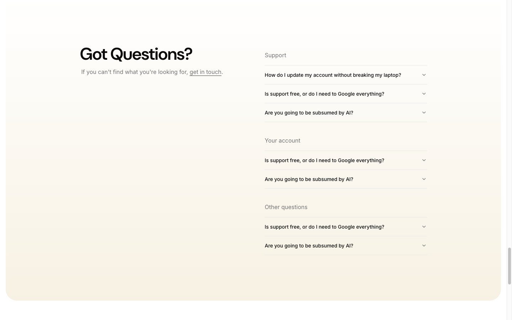

# FAQ Section — "Got Questions?"



## Описание
Секция FAQ с заголовком, подзаголовком со ссылкой "get in touch" слева и тремя группами accordion-вопросов справа. Layout: 2 колонки grid.

## Layout
- Section classes: `py-28 lg:py-32`
- Container: max-w-5xl (1024px)
- Grid: `mx-auto grid gap-16 lg:grid-cols-2`
- 2 колонки с gap 64px (gap-16)

## Элементы

### H2 — "Got Questions?"
- Font: DM Sans 48px / 600
- Letter-spacing: -1.2px
- Left column, top

### Subtitle
- "If you can't find what you're looking for, get in touch."
- "get in touch" — underlined link to /contact

### FAQ Categories (right column)
3 группы: Support, Your account, Other questions

Each group:

#### Category Title (h3)
- Font: Inter, normal weight
- Color: muted-foreground-ish
- Margin-bottom before items

#### Accordion Items
- Component: Radix Accordion (shadcn/ui)
- Each item has border-bottom (`border-b`)
- Trigger: `flex w-full items-center justify-between text-base font-medium`
- Chevron: rotates 180deg on open
- Content: animate accordion-down / accordion-up
- Answer text: Inter 14px / 400, muted-foreground

### Animation
```css
@keyframes accordion-down {
  0% { height: 0px; }
  100% { height: var(--radix-accordion-content-height); }
}
@keyframes accordion-up {
  0% { height: var(--radix-accordion-content-height); }
  100% { height: 0px; }
}
```

### Questions
#### Support
1. How do I update my account without breaking my laptop?
2. Is support free, or do I need to Google everything?
3. Are you going to be subsumed by AI?

#### Your account
1. Is support free, or do I need to Google everything?
2. Are you going to be subsumed by AI?

#### Other questions
1. Is support free, or do I need to Google everything?
2. Are you going to be subsumed by AI?

## Используется на страницах
- Главная (/)
- FAQ (/faq) — как standalone (h1 вместо h2, single-column layout)

## Код компонента
```tsx
import Link from "next/link";
import { Accordion, AccordionContent, AccordionItem, AccordionTrigger } from "@/components/ui/accordion";

const faqCategories = [
  {
    title: "Support",
    questions: [
      { q: "How do I update my account without breaking my laptop?", a: "Answer text here..." },
      { q: "Is support free, or do I need to Google everything?", a: "Answer text here..." },
      { q: "Are you going to be subsumed by AI?", a: "Answer text here..." },
    ],
  },
  {
    title: "Your account",
    questions: [
      { q: "Is support free, or do I need to Google everything?", a: "Answer text here..." },
      { q: "Are you going to be subsumed by AI?", a: "Answer text here..." },
    ],
  },
  {
    title: "Other questions",
    questions: [
      { q: "Is support free, or do I need to Google everything?", a: "Answer text here..." },
      { q: "Are you going to be subsumed by AI?", a: "Answer text here..." },
    ],
  },
];

export function FAQSection() {
  return (
    <section className="py-28 lg:py-32">
      <div className="container max-w-5xl">
        <div className="mx-auto grid gap-16 lg:grid-cols-2">
          {/* Left: Title */}
          <div>
            <h2 className="text-3xl tracking-tight md:text-4xl lg:text-5xl">
              Got Questions?
            </h2>
            <p className="text-muted-foreground mt-4">
              If you can't find what you're looking for,{" "}
              <Link href="/contact" className="underline">get in touch</Link>.
            </p>
          </div>

          {/* Right: Accordions */}
          <div className="space-y-8">
            {faqCategories.map((cat) => (
              <div key={cat.title}>
                <h3 className="mb-4 text-lg text-muted-foreground">{cat.title}</h3>
                <Accordion type="single" collapsible>
                  {cat.questions.map((item, i) => (
                    <AccordionItem key={i} value={`${cat.title}-${i}`}>
                      <AccordionTrigger>{item.q}</AccordionTrigger>
                      <AccordionContent>{item.a}</AccordionContent>
                    </AccordionItem>
                  ))}
                </Accordion>
              </div>
            ))}
          </div>
        </div>
      </div>
    </section>
  );
}
```
