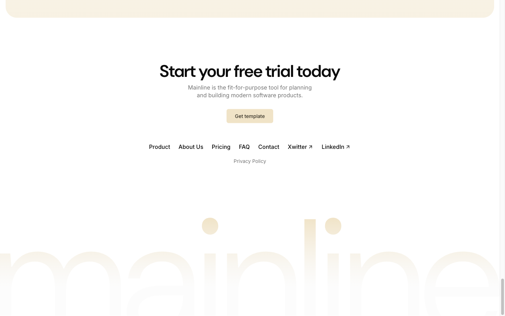

# Footer (CTA + Nav + Logo)



## Описание
Footer с тремя блоками: CTA-секция (заголовок + описание + кнопка), навигация (горизонтальный список ссылок + privacy policy), и большой декоративный логотип "mainline" на фоне.

## Layout
- Tag: `<footer>`
- Classes: `flex flex-col items-center gap-14 pt-28 lg:pt-32`
- Display: flex column
- Align: center
- Gap: 56px (gap-14)
- Padding-top: 128px

## Элементы

### CTA Block
- Text-align: center

#### H2 — "Start your free trial today"
- Font: DM Sans 48px / 600
- Letter-spacing: -1.2px

#### Description
- Font: Inter 16px / 400
- Color: oklch(0.556 0 0) — muted-foreground
- Max-width: 576px (max-w-xl), mx-auto, text-balance

#### "Get template" Button
- Background: oklch(0.92 0.04 86.47) — primary
- Color: oklch(0.31 0.02 86.64) — primary-foreground
- Border-radius: 6px
- Padding: 0 24px (px-6)
- Font: Inter 14px / 500
- Larger padding than header CTA (h-10 vs h-9)

### Navigation
- Horizontal list of links
- Font: Inter 14px / 500

Links:
- Product → /#feature-modern-teams
- About Us → /about
- Pricing → /pricing
- FAQ → /faq
- Contact → /contact
- Xwitter → https://x.com/ausrobdev (external, has arrow icon)
- LinkedIn → # (external, has arrow icon)

Second row:
- Privacy Policy → /privacy

### Decorative Logo
- Large "mainline" text/SVG at bottom
- Very large, low opacity/muted
- Overflows bottom of page
- Decorative only

## Используется на страницах
- ВСЕ страницы (общий компонент)

## Код компонента
```tsx
import Link from "next/link";
import { Button } from "@/components/ui/button";
import { ArrowUpRight } from "lucide-react";

const navLinks = [
  { label: "Product", href: "/#feature-modern-teams" },
  { label: "About Us", href: "/about" },
  { label: "Pricing", href: "/pricing" },
  { label: "FAQ", href: "/faq" },
  { label: "Contact", href: "/contact" },
  { label: "Xwitter", href: "https://x.com/ausrobdev", external: true },
  { label: "LinkedIn", href: "#", external: true },
];

export function Footer() {
  return (
    <footer className="flex flex-col items-center gap-14 pt-28 lg:pt-32">
      {/* CTA */}
      <div className="text-center">
        <h2 className="text-3xl tracking-tight md:text-4xl lg:text-5xl">
          Start your free trial today
        </h2>
        <p className="text-muted-foreground mx-auto mt-4 max-w-xl leading-snug text-balance">
          Mainline is the fit-for-purpose tool for planning and building modern software products.
        </p>
        <Button asChild className="mt-6">
          <Link href="#">Get template</Link>
        </Button>
      </div>

      {/* Navigation */}
      <nav>
        <ul className="flex flex-wrap items-center justify-center gap-6">
          {navLinks.map((link) => (
            <li key={link.label}>
              <Link
                href={link.href}
                className="text-sm font-medium hover:opacity-75 transition-opacity inline-flex items-center gap-1"
              >
                {link.label}
                {link.external && <ArrowUpRight className="size-3" />}
              </Link>
            </li>
          ))}
        </ul>
        <ul className="mt-4 flex justify-center">
          <li>
            <Link href="/privacy" className="text-sm text-muted-foreground hover:opacity-75 transition-opacity">
              Privacy Policy
            </Link>
          </li>
        </ul>
      </nav>

      {/* Decorative logo */}
      
    </footer>
  );
}
```
