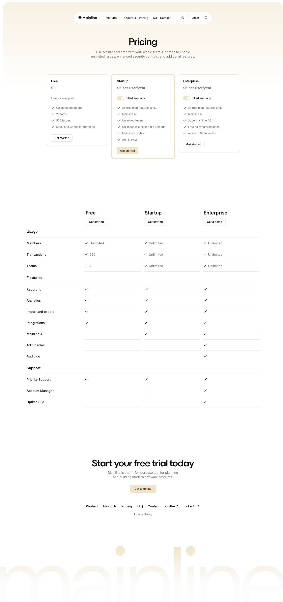

# Pricing Comparison Table



## Описание
Таблица сравнения тарифов с header (названия планов + кнопки) и секциями Usage, Features, Support. Каждая строка имеет лейбл слева и check/value для каждого плана.

## Layout
- Positioned below pricing cards
- Full-width within container
- Grid-like table structure

## Структура

### Table Header
3 колонки: Free | Startup | Enterprise
Каждая: h3 + Button ("Get started" / "Get a demo")

### Секции

#### Usage
| Feature | Free | Startup | Enterprise |
|---------|------|---------|-----------|
| Members | Unlimited | Unlimited | Unlimited |
| Transactions | 250 | Unlimited | Unlimited |
| Teams | 2 | Unlimited | Unlimited |

#### Features
| Feature | Free | Startup | Enterprise |
|---------|------|---------|-----------|
| Reporting | check | check | check |
| Analytics | check | check | check |
| Import and export | check | check | check |
| Integrations | check | check | check |
| Mainline AI | - | check | check |
| Admin roles | - | - | check |
| Audit log | - | - | check |

#### Support
| Feature | Free | Startup | Enterprise |
|---------|------|---------|-----------|
| Priority Support | check | check | check |
| Account Manager | - | - | check |
| Uptime SLA | - | - | check |

## Стили
- Row: flex, border-bottom
- Label: text-sm font-medium, left column
- Values: 3 equal columns, centered
- Check icon: SVG checkmark
- Section title (h3): font-semibold, border-top, padding-top
- Alternating background for readability (optional)

## Код компонента
```tsx
import { Button } from "@/components/ui/button";
import { Check, Minus } from "lucide-react";

const plans = ["Free", "Startup", "Enterprise"];
const buttonLabels = ["Get started", "Get started", "Get a demo"];

const sections = [
  {
    title: "Usage",
    rows: [
      { label: "Members", values: ["Unlimited", "Unlimited", "Unlimited"] },
      { label: "Transactions", values: ["250", "Unlimited", "Unlimited"] },
      { label: "Teams", values: ["2", "Unlimited", "Unlimited"] },
    ],
  },
  {
    title: "Features",
    rows: [
      { label: "Reporting", values: [true, true, true] },
      { label: "Analytics", values: [true, true, true] },
      { label: "Import and export", values: [true, true, true] },
      { label: "Integrations", values: [true, true, true] },
      { label: "Mainline AI", values: [false, true, true] },
      { label: "Admin roles", values: [false, false, true] },
      { label: "Audit log", values: [false, false, true] },
    ],
  },
  {
    title: "Support",
    rows: [
      { label: "Priority Support", values: [true, true, true] },
      { label: "Account Manager", values: [false, false, true] },
      { label: "Uptime SLA", values: [false, false, true] },
    ],
  },
];

export function ComparisonTable() {
  return (
    <div className="mt-20">
      {/* Header */}
      <div className="grid grid-cols-[1fr_repeat(3,1fr)] items-end gap-4 border-b pb-4">
        <div />
        {plans.map((plan, i) => (
          <div key={plan} className="text-center">
            <h3 className="font-semibold">{plan}</h3>
            <Button variant="outline" size="sm" className="mt-2">{buttonLabels[i]}</Button>
          </div>
        ))}
      </div>

      {/* Sections */}
      {sections.map((section) => (
        <div key={section.title}>
          <h3 className="mt-8 border-t pt-8 font-semibold">{section.title}</h3>
          {section.rows.map((row) => (
            <div key={row.label} className="grid grid-cols-[1fr_repeat(3,1fr)] items-center border-b py-4">
              <div className="text-sm font-medium">{row.label}</div>
              {row.values.map((val, i) => (
                <div key={i} className="text-center">
                  {typeof val === "boolean" ? (
                    val ? <Check className="mx-auto size-4" /> : <Minus className="mx-auto size-4 text-muted-foreground" />
                  ) : (
                    <div className="flex items-center justify-center gap-1">
                      <Check className="size-4" />
                      <span className="text-sm">{val}</span>
                    </div>
                  )}
                </div>
              ))}
            </div>
          ))}
        </div>
      ))}
    </div>
  );
}
```
